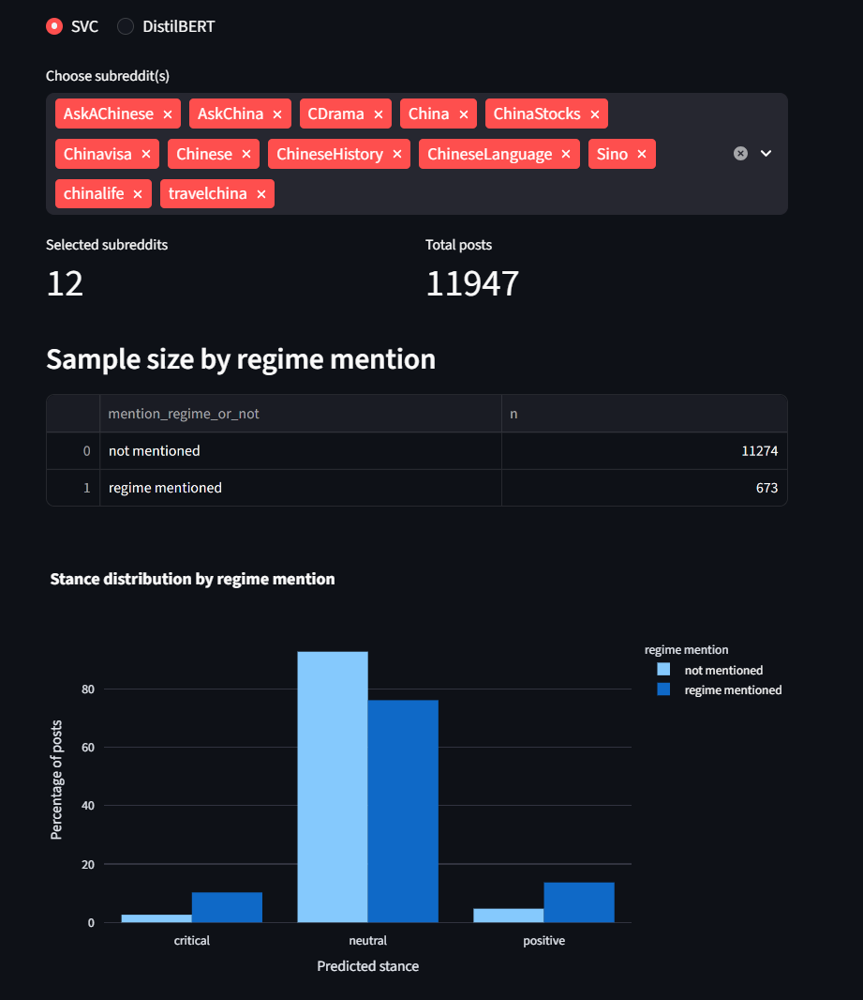

# China-related Subreddit Stance Analyzer

An end-to-end NLP project for examining whether China-related Reddit posts show different stance patterns when they explicitly mention the PRC regime. The repository covers data collection, rule-based feature construction, manual annotation, model training, batch prediction, and interactive exploration.



## Project highlights

- Collected and analyzed **11,947 posts from 12 China-related subreddits** through Reddit's public JSON endpoint.
- Built a Streamlit interface and manually annotated **300 posts** as `critical`, `neutral`, or `positive` toward China and Chinese people.
- Compared a TF-IDF + LinearSVC baseline with a fine-tuned DistilBERT classifier.
- Achieved **0.70 accuracy and 0.53 macro F1** with LinearSVC, compared with **0.70 accuracy and 0.39 macro F1** for DistilBERT on the 60-post test set.
- Developed a Streamlit and Plotly dashboard for comparing stance distributions across subreddit groups and regime-mention categories.

## Research question

When posts in China-related subreddits mention the PRC regime, do their stance distributions differ from posts that do not mention it?

The analysis indicates that regime-mentioning posts contain a lower share of neutral predictions and higher shares of evaluative stances. The pattern is stronger in political, historical, and economic communities than in culture- and lifestyle-oriented communities. These results are exploratory and should be interpreted in light of the small, imbalanced manually labeled sample.

## Pipeline

1. Collect posts from selected subreddits.
2. Detect regime-related language using a documented regular-expression rule.
3. Draw a balanced sample of regime-mentioning and non-mentioning posts.
4. Label the sample through a Streamlit annotation interface.
5. Create a reproducible 240/60 stratified train-test split.
6. Train and evaluate LinearSVC and DistilBERT classifiers.
7. Apply the models to the larger dataset.
8. Explore the results through an interactive dashboard.

## Repository structure

```text
.
|-- assets/                       # README images
|-- data/
|   |-- labeling/                 # Annotation sample and saved labels
|   `-- training_data/            # 240 training and 60 test records
|-- src/
|   |-- SVC_version/              # LinearSVC training and prediction
|   |-- DistilBERT_version/       # DistilBERT training and prediction
|   |-- reddit_collector.py
|   |-- detect_regime.py
|   |-- random_sampling_300.py
|   |-- manually_label_dashboard.py
|   |-- merge_and_split.py
|   `-- stance_dashboard.py
|-- project_report.pdf
`-- requirements.txt
```

Raw Reddit data, processed prediction files, and trained model artifacts are intentionally excluded from version control.

## Setup

Python 3.10 or later is recommended.

```bash
python -m venv .venv
```

Activate the environment on macOS or Linux:

```bash
source .venv/bin/activate
```

On Windows PowerShell:

```powershell
.venv\Scripts\Activate.ps1
```

Install the dependencies:

```bash
pip install -r requirements.txt
```

## Run the pipeline

Run all commands from the repository root.

```bash
python src/reddit_collector.py
python src/detect_regime.py
python src/random_sampling_300.py
streamlit run src/manually_label_dashboard.py
python src/merge_and_split.py
```

Train and apply the classical model:

```bash
python src/SVC_version/train_model_svc.py
python src/SVC_version/predict_10k_svc.py
```

Alternatively, train and apply DistilBERT:

```bash
python src/DistilBERT_version/train_model_distilbert.py
python src/DistilBERT_version/predict_10k_distilbert.py
```

After generating predictions from both models, launch the comparison dashboard:

```bash
streamlit run src/stance_dashboard.py
```

## Results

| Model | Accuracy | Macro F1 |
|---|---:|---:|
| TF-IDF + LinearSVC | 0.70 | 0.53 |
| DistilBERT | 0.70 | 0.39 |

The classical model performed better on macro F1 under the current data conditions. With only 300 manually annotated examples and substantial class imbalance, the comparison should be treated as a prototype-level result rather than a general performance claim.

## Limitations

- The annotation scheme was created for an exploratory course project and was applied by a single annotator.
- The manually labeled dataset is small and class-imbalanced.
- The regular-expression feature operationalizes a broad political concept and can produce false positives or false negatives.
- The included metrics come from one stratified train-test split; cross-validation and external validation would strengthen the evaluation.
- Availability and behavior of Reddit's public JSON endpoint may change.

## Further material

- [Full project report](project_report.pdf)
- [Short demonstration video](https://cloud.uni-konstanz.de/index.php/f/227184428)

Developed as the final project for *Introduction to Computing for the Social Sciences*, University of Konstanz, Winter Semester 2025/26.
